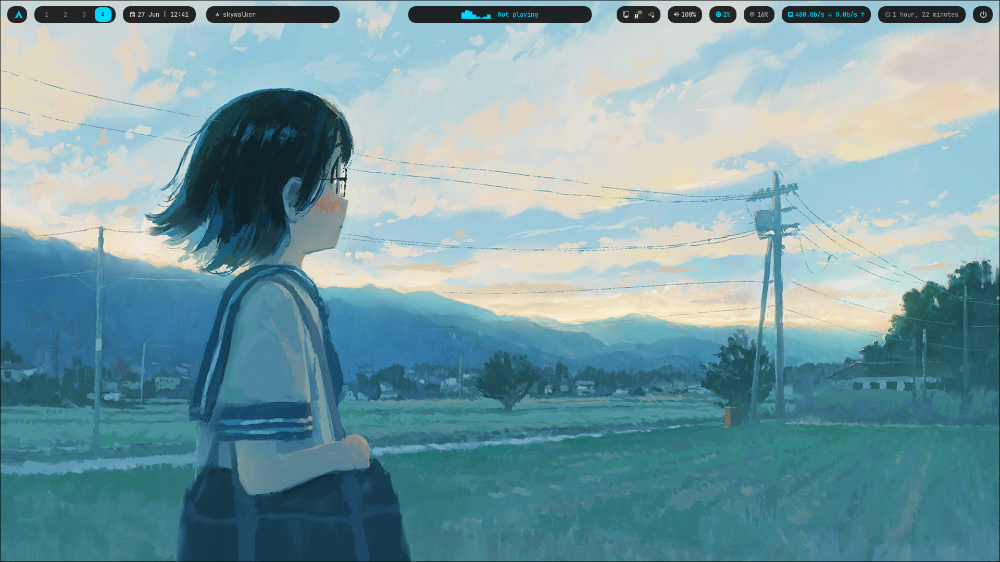
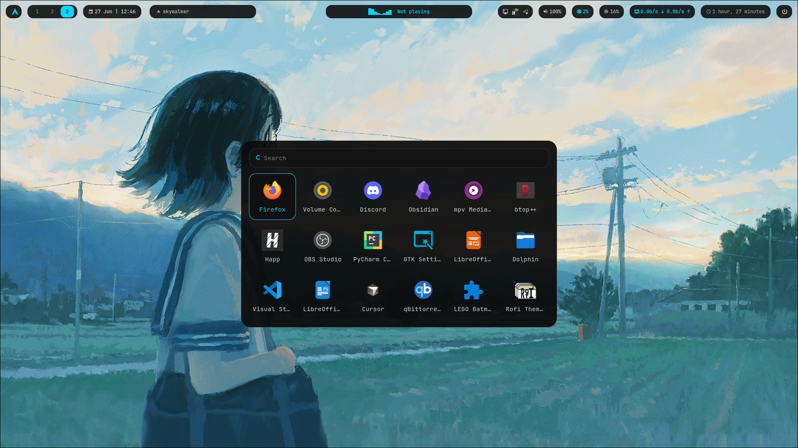
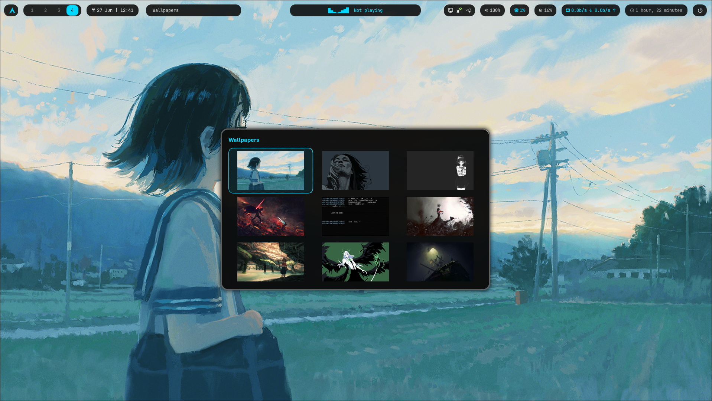
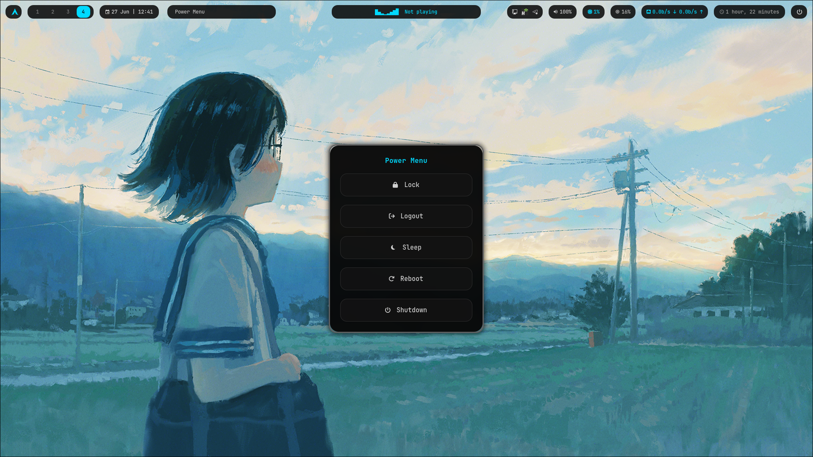
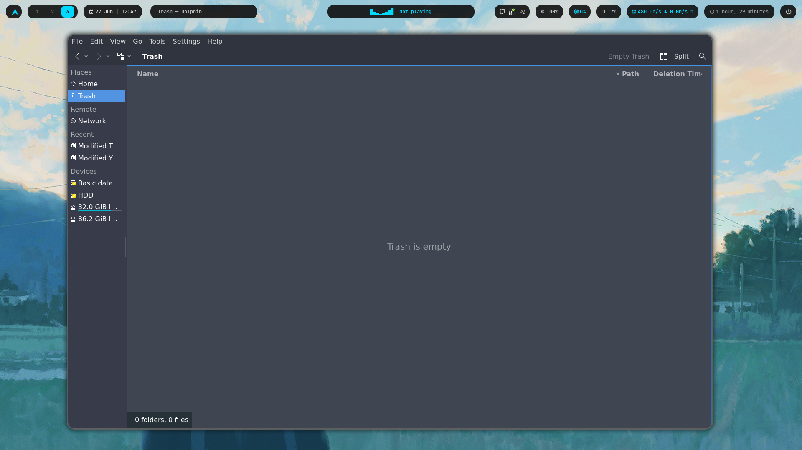
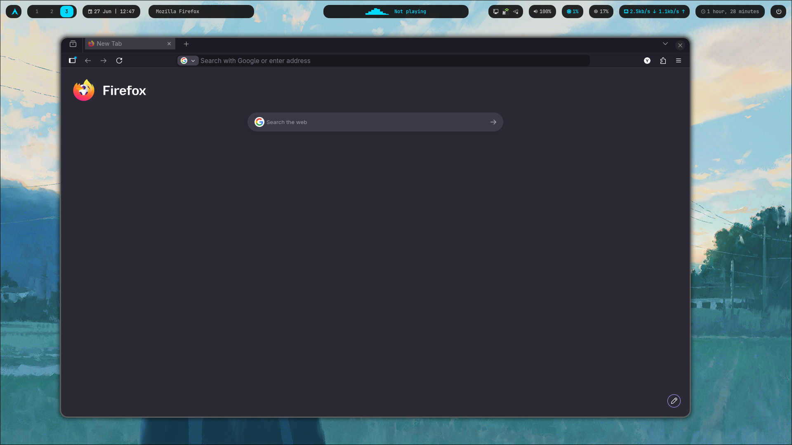

# SkyHypr

<div align="center">

# 🌌 SkyHypr

*A modern Hyprland setup focused on minimalism, smooth animations and custom utilities.*



</div>

---

## ✨ Features

* 🪟 Hyprland
* 🎨 Minimal black & cyan theme
* 🚀 Waybar
* 🖥 Kitty
* 🔍 Rofi
* 📁 Dolphin
* 🌐 Firefox CSS
* 📊 Fastfetch
* 🎵 Cava
* 🔔 SwayNC

### Custom Utilities

* 🖼 Wallpaper Picker
* ⏻ Power Menu

---

# 📸 Gallery

| Desktop                      | Rofi                      |
| ---------------------------- | ------------------------- |
|  |  |

| Wallpaper Picker                      | Power Menu                      |
| ------------------------------------- | ------------------------------- |
|  |  |

| Dolphin                      | Firefox                      |
| ---------------------------- | ---------------------------- |
|  |  |

---

# 📦 Installation

Clone the repository

```bash
git clone https://github.com/YOUR_USERNAME/SkyHypr.git

cd SkyHypr
```

Make installer executable

```bash
chmod +x install.sh
```

Run installer

```bash
./install.sh
```

---

# ⌨ Default Keybinds

| Key               | Action           |
| ----------------- | ---------------- |
| Super + D         | Rofi Launcher    |
| Super + W         | Wallpaper Picker |
| Super + Shift + E | Power Menu       |

---

# 📂 Repository Structure

```
SkyHypr
├── .config
├── screenshots
├── scripts
├── wallpapers
├── install.sh
├── packages.txt
└── README.md
```

---

# ❤️ Credits

* Hyprland
* Waybar
* Kitty
* Rofi
* Fastfetch
* Cava

---

## ⭐ If you like this project, consider giving it a star.
