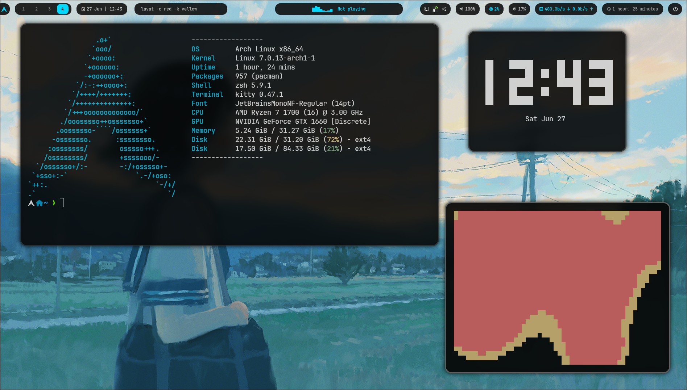

# SkyHypr

Minimal black/cyan Hyprland setup with custom utilities.

## Features

- Hyprland
- Waybar
- Kitty
- Rofi
- Fastfetch
- Cava
- Dolphin styling
- Firefox CSS
- Custom Wallpaper Picker
- Custom Power Menu

## Gallery

## Installation

Coming soon.

## Keybindings

| Keybind | Action |
|---|---|
| `Super + D` | App launcher |
| `Super + W` | Wallpaper picker |
| `Super + Shift + E` | Power menu |

## Credits

Made for Arch Linux + Hyprland.
